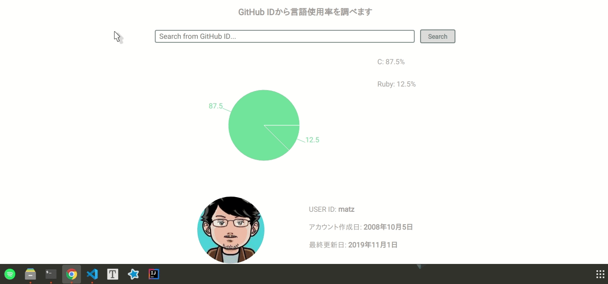

<h2 align="center">ギッハブサーチ</h2>

  
  

## 🏠 App URL

### **https://optimistic-kowalevski-6b75ad.netlify.com/**

## 🍥 Feature

<h3 align="center">言語使用率が分かる！神！</h3>

## 👽 License

MIT

## 🤔 Author

<a href="https://twitter.com/omochizou">Twitter</a>
